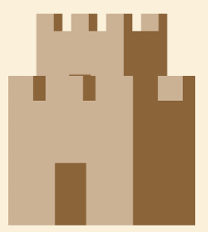

  

<h1 align="center">Tower Defense Game</h1>

  JavaFX-based Tower Defense game developed using object-oriented design principles.

  
  
  
  

A JavaFX-based Tower Defense game developed as a university term project.

## 📖 Project Description

This project is a desktop Tower Defense game where:

- Enemies follow a predefined path from level files
- Towers automatically attack enemies in range
- Player health decreases if enemies reach the base
- Player earns money when enemies are destroyed

The game uses object-oriented design principles and JavaFX for GUI.

## 🛠 Technologies Used

- Java
- JavaFX
- OOP Design
- File I/O for level management

## 📂 Project Structure

src/ → Java source files  
resources/levels/ → Level path files  
resources/images/ → Game assets  
docs/ → Project report  

## ▶ How to Run

1. Open the project in IntelliJ IDEA / Eclipse
2. Configure JavaFX SDK
3. Run Main.java

## 👩‍💻 Authors

Group 22 – Marmara University Computer Engineering

- Tuba İskol
- Ali Berkay Guven
- Fahrettin Enes Sahin
 

## 📄 Project Report

The full project report is available in the `docs` folder.
